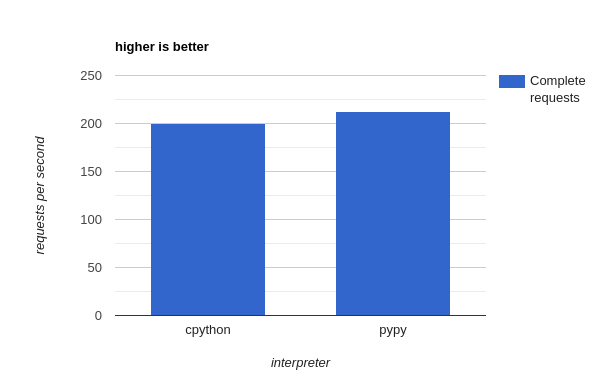
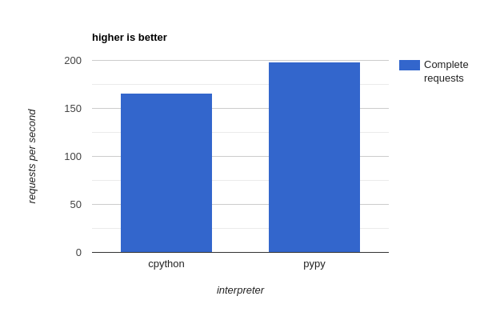

## World Countries
### Django rest api

Simple Application to test performance of Django with pypy3.

### Required development packages on Ubuntu
```bash
add-apt-repository ppa:pypy/ppa
apt update
apt install pypy3
apt-get install pypy3-dev
apt-get install python3-dev
apt-get install libpq-dev
apt-get install libev-dev
apt-get install gcc
```

### Project requirements
```bash
pypy3 -m venv venv
(venv) pypy3 -m pip install --upgrade setuptools
(venv) pypy3 -m pip install -r requirements.txt
```

### .env 
```
DB_ENGINE = django.db.backends.postgresql
DB_NAME = ***
DB_USER = ***
DB_PASSWORD = ***
DB_HOST = ***
DB_PORT = ***

DJANGO_SECRET = ***
ALLOWED_HOSTS = *
```

### Django database adapter changes from psycopg2 to psycopg2cffi
Replace psycopg2 to psycopg2cffi in these modules:
- /django/db/backends/postgresql/base.py
- /django/db/backends/postgresql/creation.py
- /django/db/backends/postgresql/operations.py
- /django/db/backends/postgresql/schema.py


### Deployment commands
```bash
gunicorn core.wsgi:application --bind 0.0.0.0:8000 --workers 10
``` 

### Note
If you recieve this error on cryptography >= 3.5:
```bash
This package requires Rust >=1.48.0.
```
You can install Rust according to [this instruction](https://www.digitalocean.com/community/tutorials/install-rust-on-ubuntu-linux).


### Result
5k requests



250k requests

