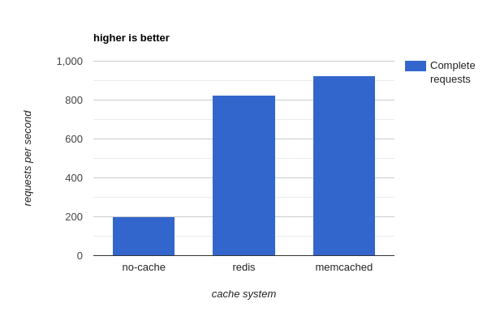

## World Countries
### Django rest api

Simple Application to test performance of Django cache.

### Required development packages on Ubuntu
```bash
apt-get install python3-dev
apt-get install libpq-dev
apt-get install libev-dev
apt-get install gcc
```

### .env 
```
DB_ENGINE = django.db.backends.postgresql
DB_NAME = ***
DB_USER = ***
DB_PASSWORD = ***
DB_HOST = ***
DB_PORT = ***

REDIS_HOST= ***
REDIS_PORT= ***

MEMCACHED_HOST= ***
MEMCACHED_PORT= ***

DJANGO_SECRET = ***
ALLOWED_HOSTS = *
```

### Deployment commands
```bash
gunicorn core.wsgi:application --bind 0.0.0.0:8000 --workers 10
``` 

### Result
