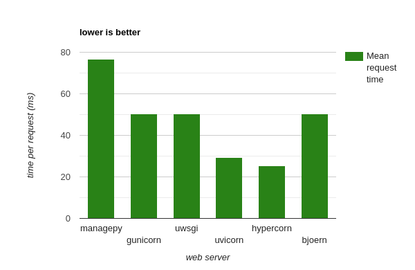
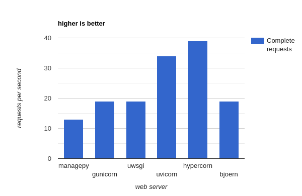

## World Countries
### Django rest api

Simple Application to test performance of Django together with pythonic webservers.

### Required development packages on Ubuntu
```bash
apt-get install python3-dev
apt-get install libpq-dev
apt-get install libev-dev
apt-get install gcc
```

### .env 
```
DB_ENGINE = django.db.backends.postgresql
DB_NAME = ***
DB_USER = ***
DB_PASSWORD = ***
DB_HOST = ***
DB_PORT = ***

DJANGO_SECRET = ***
ALLOWED_HOSTS = *
```

### Deployment commands
+ Gunicorn
```bash
gunicorn core.wsgi:application --bind 0.0.0.0:8000 --workers 10 --worker-class [eventlet|gevent|tornado|gthread] 
``` 
+ Uvicorn
```bash
uvicorn core.asgi:application --host 0.0.0.0 --port 8000 --workers 10 --loop [asyncio|uvloop] --no-access-log
```
+ Hypercorn
```bash
hypercorn core.asgi:application --bind 0.0.0.0:8000 --workers 10 --worker-class [asyncio|uvloop] 
```
+ uWSGI
```bash
uwsgi --module core.wsgi:application --http 0.0.0.0:8000 --workers 10 --gevent 100 --disable-logging
```
+ Bjoern
```bash
bjcli core.wsgi -w 10 -i 0.0.0.0 -p 8000
```

### Note
Uncomment DJANGO_ALLOW_ASYNC_UNSAFE in core.wsgi when using gunicorn[tornado]

### Result



### To see full documentation follow this [link](https://medium.com/@amirayat20/which-python-web-server-is-best-suited-to-django-bfe453a6f7ad)
